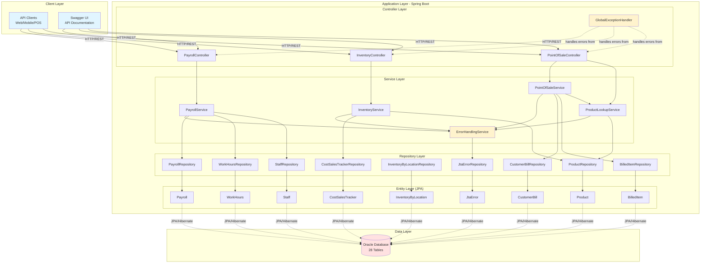
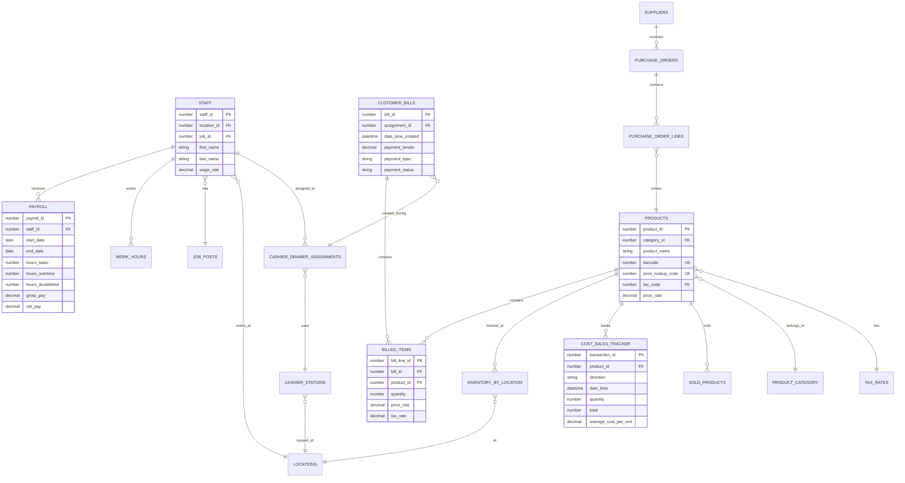
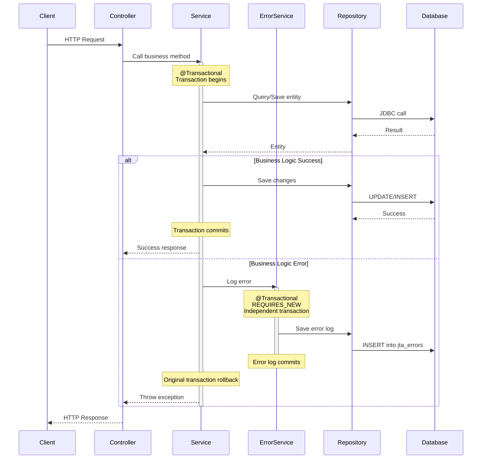
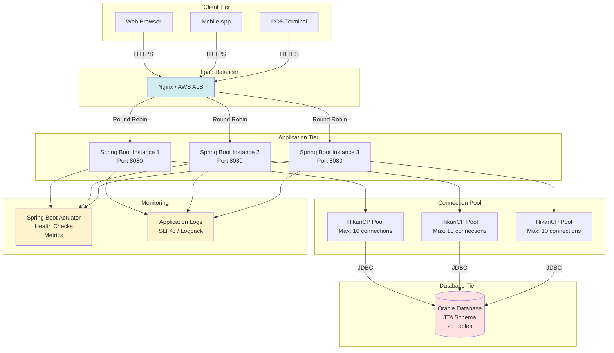
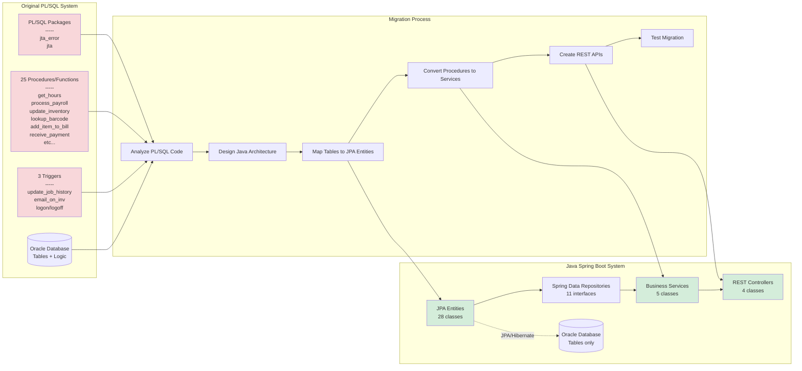
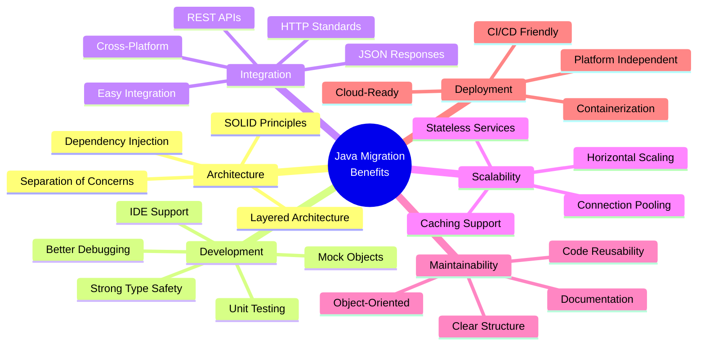
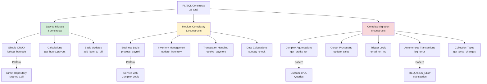

# JTA Grocery Market - System Architecture

This document provides visual architecture diagrams for the Java Spring Boot migration of the JTA Supermarkets system.

---

## High-Level Architecture



---

## Detailed Component Architecture

```mermaid
graph TB
    subgraph "REST API Layer"
        direction LR
        PC["/api/payroll<br/>PayrollController"]
        IC["/api/inventory<br/>InventoryController"]
        POSC["/api/pos<br/>PointOfSaleController"]
    end

    subgraph "Business Logic Layer"
        direction TB

        subgraph "Payroll Domain"
            PS[PayrollService<br/>-----<br/>processPayroll()<br/>getHours()<br/>sundayCheck()<br/>getPayout()]
        end

        subgraph "Inventory Domain"
            IS[InventoryService<br/>-----<br/>updateInventory()<br/>updateSales()<br/>stockCheck()]
        end

        subgraph "POS Domain"
            POSS[PointOfSaleService<br/>-----<br/>addItemToBill()<br/>receivePayment()]
            PLS[ProductLookupService<br/>-----<br/>lookupBarcode()]
        end

        subgraph "Cross-Cutting"
            ES[ErrorHandlingService<br/>-----<br/>logError()<br/>showInConsole()]
        end
    end

    subgraph "Data Access Layer"
        direction LR

        subgraph "Spring Data JPA"
            PR[ProductRepository]
            SR[StaffRepository]
            PayR[PayrollRepository]
            WHR[WorkHoursRepository]
            CTR[CostSalesTrackerRepository]
            IBR[InventoryByLocationRepository]
            CBR[CustomerBillRepository]
            BIR[BilledItemRepository]
            ER[JtaErrorRepository]
            CDAR[CashierDrawerAssignmentRepository]
            SPR[SoldProductRepository]
        end
    end

    subgraph "Domain Model (JPA Entities)"
        direction LR

        subgraph "Product Entities"
            PE[Product]
            PCE[ProductCategory]
            TRE[TaxRate]
        end

        subgraph "Staff Entities"
            SE[Staff]
            JPE[JobPost]
            PayE[Payroll]
            WHE[WorkHours]
        end

        subgraph "Inventory Entities"
            IBLE[InventoryByLocation]
            CSTE[CostSalesTracker]
            SPE[SoldProduct]
        end

        subgraph "POS Entities"
            CBE[CustomerBill]
            BIE[BilledItem]
            CSE[CashierStation]
            CDAE[CashierDrawerAssignment]
        end

        subgraph "System Entities"
            JEE[JtaError]
            JTEE[JtaEvent]
            LE[Location]
        end

        subgraph "Supplier Entities"
            SuppE[Supplier]
            POE[PurchaseOrder]
            POLE[PurchaseOrderLine]
        end
    end

    PC --> PS
    IC --> IS
    POSC --> POSS
    POSC --> PLS

    PS --> ES
    IS --> ES
    POSS --> ES
    PLS --> ES

    PS --> PayR
    PS --> WHR
    PS --> SR

    IS --> CTR
    IS --> PR
    IS --> SPR

    POSS --> CBR
    POSS --> BIR
    POSS --> CDAR
    POSS --> PLS

    PLS --> PR

    ES --> ER

    PayR --> PayE
    WHR --> WHE
    SR --> SE
    PR --> PE
    CTR --> CSTE
    IBR --> IBLE
    CBR --> CBE
    BIR --> BIE
    ER --> JEE
    CDAR --> CDAE
    SPR --> SPE

    style ES fill:#fff3cd
    style PC fill:#d4edda
    style IC fill:#d4edda
    style POSC fill:#d4edda
```

---

## Payroll Service Architecture

```mermaid
graph TB
    subgraph "Payroll REST API"
        PC[PayrollController]
    end

    subgraph "PayrollService"
        direction TB
        PP[processPayroll<br/>Construct 03]
        GH[getHours<br/>Construct 02]
        SC[sundayCheck<br/>Construct 21]
        GP[getPayout<br/>Construct 22]
    end

    subgraph "Repositories"
        PayrollRepo[PayrollRepository<br/>-----<br/>findByStaffAndDateRange()<br/>deleteByStartDateAndEndDate()]
        WorkHoursRepo[WorkHoursRepository<br/>-----<br/>findDistinctStaffIdsByDateRange()<br/>findByStaffIdAndDateRange()]
        StaffRepo[StaffRepository<br/>-----<br/>findById()]
    end

    subgraph "Entities & Database"
        PayrollEntity[Payroll Entity<br/>-----<br/>payrollId, staffId<br/>startDate, endDate<br/>hoursBasic, hoursOvertime, hoursDoubletime<br/>grossPay, netPay<br/>natInsuranceDeduction, hltSurchargeDeduction]

        WorkHoursEntity[WorkHours Entity<br/>-----<br/>staffId, workDate<br/>hoursWorked]

        StaffEntity[Staff Entity<br/>-----<br/>staffId, firstName, lastName<br/>wageRate, wageInterval<br/>paymentSchedule]
    end

    PC -->|POST /process| PP
    PC -->|GET /hours/{id}| GH
    PC -->|GET /sunday-check/{id}| SC
    PC -->|GET /payout/{id}| GP

    PP -->|1. Get staff who worked| WorkHoursRepo
    PP -->|2. For each staff| GH
    PP -->|3. Get staff details| StaffRepo
    PP -->|4. Calculate pay| Calculate[Calculate Gross Pay<br/>-----<br/>basic × rate<br/>overtime × rate × 1.5<br/>doubletime × rate × 2]
    PP -->|5. Calculate deductions| Deduct[Calculate Deductions<br/>-----<br/>NatInsurance = gross × 0.132 / 3<br/>HltSurcharge = gross × 0.005]
    PP -->|6. Save payroll| PayrollRepo

    GH -->|Query hours| WorkHoursRepo
    GH -->|Separate by day| DayCheck{Is Sunday?}
    DayCheck -->|Yes| Double[doubletime += hours]
    DayCheck -->|No| Basic[basic += hours]
    Basic -->|> 40 hours?| OTCheck{Overtime?}
    OTCheck -->|Yes| OT[overtime = basic - 40<br/>basic = 40]

    SC -->|Get work days in month| WorkHoursRepo
    SC -->|Count Sundays| CountSun[Count Sunday occurrences]
    CountSun -->|< 2 Sundays?| Available{Available?}

    GP -->|Get payroll records| PayrollRepo
    GP -->|Sum all values| Sum[Sum gross, net, deductions]

    PayrollRepo -.-> PayrollEntity
    WorkHoursRepo -.-> WorkHoursEntity
    StaffRepo -.-> StaffEntity

    style PP fill:#d1ecf1
    style GH fill:#d1ecf1
    style SC fill:#d1ecf1
    style GP fill:#d1ecf1
    style Calculate fill:#fff3cd
    style Deduct fill:#fff3cd
```

---

## Inventory Service Architecture

```mermaid
graph TB
    subgraph "Inventory REST API"
        IC[InventoryController]
    end

    subgraph "InventoryService"
        direction TB
        UI[updateInventory<br/>Construct 04]
        US[updateSales<br/>Construct 15]
        StockCheck[stockCheck<br/>Construct 20]
    end

    subgraph "Repositories"
        CTRepo[CostSalesTrackerRepository<br/>-----<br/>findLatestByProductId()<br/>save()]
        ProdRepo[ProductRepository<br/>-----<br/>findById()]
        SoldProdRepo[SoldProductRepository<br/>-----<br/>findAll()<br/>deleteAll()]
    end

    subgraph "Business Logic"
        Validate{Validate Input}
        GetLatest[Get Latest Inventory Record]
        CalcAvg[Calculate New Average Cost<br/>-----<br/>Weighted Average Formula:<br/>newAvg = oldTotalCost + newTotalCost / combinedQty]
        Direction{Adding or<br/>Removing?}
        CheckNegative{Would total<br/>be negative?}
        SaveTracker[Save Cost Tracker Record]
    end

    subgraph "End of Day Processing"
        GetSold[Get All Sold Products]
        GroupByProduct[Group and Sum by Product]
        UpdateEach[For Each Product:<br/>updateInventory with negative qty]
        ClearSold[Clear sold_products Table]
    end

    subgraph "Entities"
        CostTrackerEntity[CostSalesTracker<br/>-----<br/>transactionId, productId<br/>direction IN/OUT<br/>quantity, total<br/>averageCostPerUnit<br/>costPerUnit, dateTime]

        SoldProductEntity[SoldProduct<br/>-----<br/>soldProductsId<br/>productId, quantity]
    end

    IC -->|POST /update| UI
    IC -->|POST /update-sales| US
    IC -->|POST /stock-check| StockCheck

    UI --> Validate
    Validate -->|Invalid| Error[Throw InvalidInputException]
    Validate -->|Valid| GetLatest
    GetLatest --> CTRepo
    CTRepo --> Direction

    Direction -->|Adding qty > 0| AddFlow[Add Flow]
    Direction -->|Removing qty < 0| RemoveFlow[Remove Flow]

    AddFlow --> ValidateCost{Cost > 0?}
    ValidateCost -->|No| Error
    ValidateCost -->|Yes| CalcAvg
    CalcAvg --> SaveTracker

    RemoveFlow --> CheckNegative
    CheckNegative -->|Yes| Error
    CheckNegative -->|No| SaveTracker

    SaveTracker --> CTRepo

    US --> GetSold
    GetSold --> SoldProdRepo
    SoldProdRepo --> GroupByProduct
    GroupByProduct --> UpdateEach
    UpdateEach --> UI
    UpdateEach --> ClearSold
    ClearSold --> SoldProdRepo

    StockCheck --> CTRepo
    StockCheck -->|If discrepancy| UI

    CTRepo -.-> CostTrackerEntity
    SoldProdRepo -.-> SoldProductEntity

    style UI fill:#d4edda
    style US fill:#d4edda
    style StockCheck fill:#d4edda
    style CalcAvg fill:#fff3cd
    style Error fill:#f8d7da
```

---

## Point of Sale Service Architecture

```mermaid
graph TB
    subgraph "POS REST API"
        POSC[PointOfSaleController]
    end

    subgraph "Services"
        POSService[PointOfSaleService]
        PLService[ProductLookupService<br/>Construct 13]
    end

    subgraph "POS Business Logic"
        AddItem[addItemToBill<br/>Construct 16]
        ReceivePay[receivePayment<br/>Construct 17]
    end

    subgraph "Product Lookup Logic"
        LookupBC[lookupBarcode]
        CheckType{Barcode<br/>Type?}
        StandardBC[Standard Barcode<br/>12-13 digits]
        PLU[PLU Code<br/>Starts with '2']
        ParsePLU[Parse PLU<br/>-----<br/>pluCode = substr 0,5<br/>price = substr 6,11 / 100]
    end

    subgraph "Repositories"
        BillRepo[CustomerBillRepository<br/>-----<br/>findUnpaidBillById()<br/>save()]
        BilledItemRepo[BilledItemRepository<br/>-----<br/>findByProductIdAndBillId()<br/>save()]
        ProdRepo[ProductRepository<br/>-----<br/>findByBarcode()<br/>findByPriceLookupCode()]
        CashierRepo[CashierDrawerAssignmentRepository<br/>-----<br/>save()]
    end

    subgraph "Payment Processing"
        ValidatePayment{Validate<br/>Payment Type}
        CheckStatus{Already<br/>Paid?}
        CalcChange[Calculate Change<br/>-----<br/>if amount >= tender:<br/>  change = amount - tender<br/>  status = 'paid'<br/>else:<br/>  status = 'pending']
        UpdateBill[Update Bill]
        UpdateDrawer[Update Cashier Drawer<br/>-----<br/>if cash: cashEnd += amount - change<br/>else: nonCash += amount]
        UpdateInventory[Update Inventory from Bill]
    end

    subgraph "Entities"
        BillEntity[CustomerBill<br/>-----<br/>billId, assignmentId<br/>paymentTender, paymentAmount<br/>paymentType, paymentStatus<br/>dateTimeCreated, dateTimePaid]

        BilledItemEntity[BilledItem<br/>-----<br/>billLineId, billId, productId<br/>quantity, priceRate<br/>taxCode, taxRate]

        ProductEntity[Product<br/>-----<br/>productId, productName<br/>barcode, priceLookupCode<br/>priceRate, taxCode]

        CashierEntity[CashierDrawerAssignment<br/>-----<br/>assignmentId, staffId<br/>cashAmountStart, cashAmountEnd<br/>nonCashTender]
    end

    POSC -->|POST /bills/{id}/items| AddItem
    POSC -->|POST /bills/{id}/payment| ReceivePay
    POSC -->|GET /lookup?barcode=| PLService

    AddItem -->|1. Verify bill unpaid| BillRepo
    AddItem -->|2. Lookup product| PLService
    AddItem -->|3. Check if exists| BilledItemRepo
    AddItem -->|4a. Update quantity| BilledItemRepo
    AddItem -->|4b. Add new item| BilledItemRepo
    AddItem -->|5. Update bill total| BillRepo

    PLService --> LookupBC
    LookupBC --> CheckType
    CheckType -->|Standard| StandardBC
    CheckType -->|PLU starts with '2'| PLU
    StandardBC --> ProdRepo
    PLU --> ParsePLU
    ParsePLU --> ProdRepo

    ReceivePay --> ValidatePayment
    ValidatePayment -->|Invalid| Error[Throw InvalidInputException]
    ValidatePayment -->|Valid| CheckStatus
    CheckStatus -->|Paid| Error
    CheckStatus -->|Unpaid/Pending| CalcChange
    CalcChange --> UpdateBill
    UpdateBill --> BillRepo
    UpdateBill --> UpdateDrawer
    UpdateDrawer --> CashierRepo
    UpdateDrawer --> UpdateInventory

    BillRepo -.-> BillEntity
    BilledItemRepo -.-> BilledItemEntity
    ProdRepo -.-> ProductEntity
    CashierRepo -.-> CashierEntity

    style AddItem fill:#cfe2ff
    style ReceivePay fill:#cfe2ff
    style LookupBC fill:#cfe2ff
    style ParsePLU fill:#fff3cd
    style CalcChange fill:#fff3cd
    style Error fill:#f8d7da
```

---

## Error Handling Architecture

```mermaid
graph TB
    subgraph "Controllers"
        PC[PayrollController]
        IC[InventoryController]
        POSC[PointOfSaleController]
    end

    subgraph "Services"
        PS[PayrollService]
        IS[InventoryService]
        POSS[PointOfSaleService]
        PLS[ProductLookupService]
    end

    subgraph "Error Handling"
        EHS[ErrorHandlingService<br/>Construct 01]
        GEH[GlobalExceptionHandler]
    end

    subgraph "Custom Exceptions"
        JtaEx[JtaException<br/>base class<br/>errorCode: int]
        InvalidEx[InvalidInputException<br/>errorCode: -20201<br/>user input errors]
        MissingEx[MissingDataException<br/>errorCode: -20202<br/>not found errors]
    end

    subgraph "Error Logging"
        LogError[logError<br/>-----<br/>@Transactional<br/>propagation = REQUIRES_NEW<br/>autonomous transaction]
        ShowConsole[showInConsole<br/>-----<br/>trivial errors<br/>no database log]
    end

    subgraph "Database"
        ErrorRepo[JtaErrorRepository]
        ErrorEntity[JtaError Entity<br/>-----<br/>errorId, dateTime<br/>userName, code, message]
    end

    subgraph "HTTP Response"
        ErrorResponse[ErrorResponse DTO<br/>-----<br/>errorCode<br/>message<br/>timestamp]
    end

    PS -->|logs errors| EHS
    IS -->|logs errors| EHS
    POSS -->|logs errors| EHS
    PLS -->|logs errors| EHS

    PS -->|throws| InvalidEx
    PS -->|throws| MissingEx
    IS -->|throws| InvalidEx
    POSS -->|throws| InvalidEx
    PLS -->|throws| MissingEx

    InvalidEx -->|extends| JtaEx
    MissingEx -->|extends| JtaEx

    JtaEx -->|caught by| GEH
    InvalidEx -->|caught by| GEH
    MissingEx -->|caught by| GEH

    GEH -->|returns| ErrorResponse
    ErrorResponse -->|HTTP 400| PC
    ErrorResponse -->|HTTP 404| IC
    ErrorResponse -->|HTTP 500| POSC

    EHS --> LogError
    EHS --> ShowConsole

    LogError -->|REQUIRES_NEW transaction| ErrorRepo
    ErrorRepo --> ErrorEntity

    style EHS fill:#fff3cd
    style GEH fill:#fff3cd
    style JtaEx fill:#f8d7da
    style InvalidEx fill:#f8d7da
    style MissingEx fill:#f8d7da
    style LogError fill:#d1ecf1
```

---

## Database Schema Overview



---

## Transaction Management



---

## Deployment Architecture



---

## PL/SQL to Java Migration Flow



---

## Key Benefits of Migration



---

## Migration Complexity Analysis



---

Generated: 2025-11-18
Project: JTA Grocery Market Java Migration
